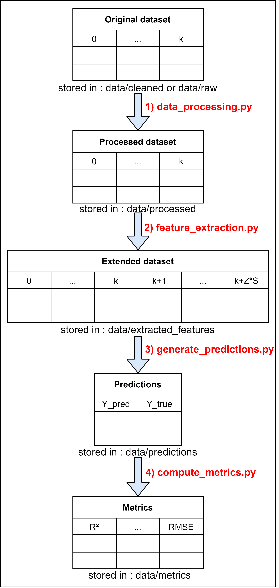

# Classification For Regression

## Directory Structure
    .
    ├── .gitignore
    ├── README.md                                   <- This file
    ├── requirements.txt                            <- The required packages
    ├── data                                        <- The datasets and the data generated by the scripts
    │   ├── cleaned                                 <- The cleaned datasets ready for use
    │   ├── extracted_features                      <- The datasets with the extracted features generated by feature_extraction.py
    │   ├── logs                                    <- The logs generated by the scripts
    │   ├── metrics                                 <- The metrics generated by compute_metrics.py
    │   ├── predictions                             <- The predictions generated by generate_predictions.py
    │   ├── processed                               <- The processed data generated by data_processing.py
    │   ├── raw                                     <- The original datasets
    │   │   └── Combined_Cycle_Power_Plant_Dataset  <- A sample dataset
    │   └── results                                 <- The results generated by the script generate_predictions.py
    ├── notebooks                                   <- The jupyter notebooks
    │   └── Datasets_First_Study.ipynb              <- Notebook to check the datasets
    ├── scripts                                     <- The scripts
    │   ├── compute_test_metrics.py                 <- Used to compute regression performance on a results folder
    │   ├── data_processing.py                      <- Used to pre-process a dataset
    │   ├── feature_extraction.py                   <- Used to extract the features of a dataset folder
    │   └── generate_predictions.py                 <- Generate the predictions of a regressor
    └── src                                         <- The source code
        ├── class_generation                        <- The discretization methods
        │   ├── BelowThresholdClassGenerator.py     <- Data under the thresholds are given a 1, others a 0
        │   ├── CustomClassGenerator.py             <- The abstract class to inherit from
        │   └── InsideBinClassGenerator.py          <- Thresholds define bins with classes numbers
        ├── models                                  <- The models used for classification or regression
        │   ├── BaseModel.py                        <- The abstract classification model to inherit from
        │   └── RandomForestC.py                    <- The random forests classifier
        ├── steps_encoding                          <- The thresholds generation methods
        │   ├── EqualFreqStepsEncoder.py            <- Generates thresholds with equal frequency
        │   ├── EqualWidthStepsEncoder.py           <- Generates thresholds with equal width
        │   └── StepsEncoder.py                     <- The abstract class to inherit from
        └── utils                                   <- Various utility methods
            ├── DataProcessingUtils.py              <- Methods used to pre-prorcess the datasets
            └── logging_util.py                     <- Message logging utility methods

## Install
This project requires python 3.7, and the libraries described in requirements.txt.

It is recommended to create a virtual environment with virtualenv to install the exact versions of the packages used in this project. You will first need to install *virtualenv* with pip :
> pip install virtualenv

Then create the virtual environment :
> virtualenv my_python_environment

Finally, activate it using :
> source my_python_environment/bin/activate

At this point, you should see the name of your virtual environment in parentheses on your terminal line.

You can now install the required libraries inside your virtual environment with :
> pip install -r requirements.txt

## Run
Here is a list of examples of usages of the scripts :

**Note :** The following examples are meant to be used from inside the 'scripts' directory.

1) We start with the Pre-processing of a dataset :
> python data_processing.py --dataset_path="../data/raw/Combined_Cycle_Power_Plant_Dataset/Folds5x2_pp.csv" --goal_var_index=4

2) We then extract the features of a pre-processed dataset using a classification algorithm :
> python feature_extraction.py --dataset_folder="../data/processed/Combined_Cycle_Power_Plant_Dataset/10_bins_equal_freq_below_threshold/" --classifier="RandomForest"

3) We can now generate the predictions using a regression model :
> python generate_predictions.py --dataset_folder="../data/extracted_features/Combined_Cycle_Power_Plant_Dataset/10_bins_equal_freq_below_threshold/RandomForest_classifier/" --regressor="RandomForest"

4) Finally, we compute the metrics on the predictions:
> python compute_metrics.py --predictions_folder="../data/predictions/Combined_Cycle_Power_Plant_Dataset/10_bins_equal_freq_below_threshold/RandomForest_classifier/RandomForest_regressor/"

For easier understanding of the flow of the dataset through the scripts, refer to the following diagram :

   

## Usage
Here are the scripts and the details about every usable parameter :

1) **data_processing.py :**
    > python data_processing.py [dataset_path] [options]
   
    The mandatory parameters are :
    * dataset_path : The dataset to process
   
    The optional parameters are :
    * output_path : The folder where the results will be saved (will be generated if not defined)
    * split_method : The splitting method to use (Choices : equal_width, equal_freq, kmeans)
    * output_classes : The method of class generation (Choices : below_threshold, inside_bin)
    * delimiter : Delimiter to use when reading the dataset
    * header : Infer the column names or use None if the first line isn't a csv header line (Choices : infer, None)
    * decimal : Character to recognize as decimal point
    * na_values : Additional string to recognize as NA/NaN
    * usecols : The indexes of the columns to keep
    * goal_var_index : The index of the column to use as the goal variable
    * n_bins : The number of bins to create
    * k_folds : The number of folds in the k-folds
    * log_lvl : Change the log display level (Choices : debug, info, warning)

2) **feature_extraction.py :**
    > python feature_extraction.py [dataset_folder] [options]

    The mandatory parameters are :
    * dataset_folder : The folder where the k-fold datasets are stored

    The optional parameters are :
    * output_path : The folder where the results will be saved (will be generated if not defined)
    * classifier : The classifier model to use (Choices : RandomForest, LogisticRegression, XGBoost, GaussianNB, Khiops)
    * class_cols : The indexes of the classes columns
    * log_lvl : Change the log display level (Choices : debug, info, warning)
   

3) **generate_predictions.py :**
    > python generate_predictions.py [dataset_folder] [regressor] [options]

    The mandatory parameters are :
    * dataset_folder : The folder where the test and train k-fold datasets are stored
    * regressor : The regression model to use (Choices : RandomForest, LogisticRegression, XGBoost, GaussianNB, Khiops)

    The options are :
    * output_path : The folder where the results will be saved (will be generated if not defined)
    * log_lvl : Change the log display level (Choices : debug, info, warning)
   

4) **compute_metrics.py :**
   > python compute_metrics.py [results_folder] [options]

    The mandatory parameters are :
    * results_folder : The folder where the results of the script *generate_predictions.py* are stored

    The options are :
    * output_path : The folder where the results will be saved (will be generated if not defined)
    * log_lvl : Change the log display level (Choices : debug, info, warning)
   

5) **visualisation.py :**
   > python visualisation.py [parent_folder] [options]

    The mandatory parameters are :
    * results_folder : The folder where the results of the script *generate_predictions.py* are stored

    The options are :
    * output_path : The folder where the results will be saved (will be generated if not defined)
    * show_variance : Whether the variance should be shown on the graph or not (Choices : true, false)
    * metric : The metric to display (Choices : r_squarred, adjusted_r_squared, MSE, RMSE, MAE)
    * log_lvl : Change the log display level (Choices : debug, info, warning)