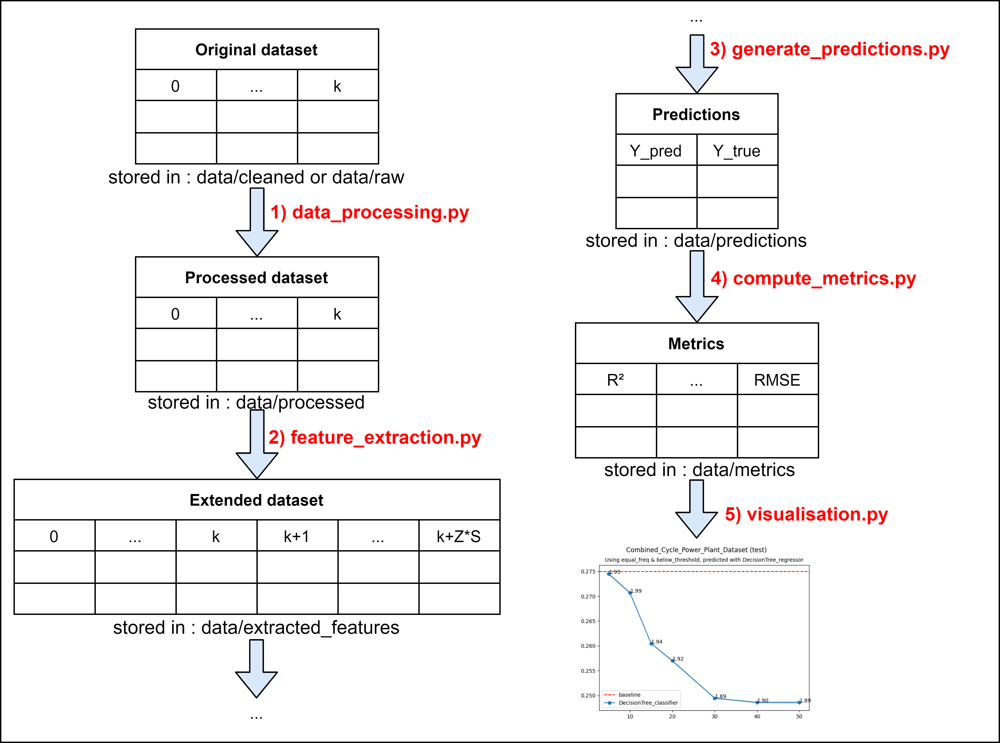

<h1 align="center">
  Classification For Regression
</h1>
  
<p align="center">
  Code used to generate the results of the EGC 2022 conference paper <a href="https://arxiv.org/abs/2112.03703">Construction de variables a l'aide de classifieurs comme aide a la regression</a>
</p>

<div align="center">
 
  [](https://opensource.org/licenses/MIT)
</div>


## 📂 Directory Structure
    .
    ├── .gitignore
    ├── README.md                                   <- This file
    ├── EGC_2022_TROISEMAINE_Colin_LEMAIRE_Vincent  <- The article with appendices
    ├── requirements.txt                            <- The required packages
    ├── data                                        <- The datasets and the data generated by the scripts
    │   ├── cleaned                                 <- The cleaned datasets ready for use
    │   ├── extracted_features                      <- The datasets with the extracted features generated by feature_extraction.py
    │   ├── figures                                 <- The figures generated by visualisation.py
    │   ├── logs                                    <- The logs generated by the scripts
    │   ├── metrics                                 <- The metrics generated by compute_metrics.py
    │   ├── predictions                             <- The predictions generated by generate_predictions.py
    │   ├── processed                               <- The processed data generated by data_processing.py
    │   └── raw                                     <- The original datasets
    │       └── Combined_Cycle_Power_Plant_Dataset  <- A sample dataset
    ├── notebooks                                   <- The jupyter notebooks
    │   ├── Datasets_First_Study.ipynb              <- Notebook to check the datasets
    │   ├── Hyperparameters study.ipynb             <- Notebook used to explore the best hyperparameters
    │   └── New dataset choice.ipynb                <- Notebook to select difficult datasets to add to our study
    ├── scripts                                     <- The scripts
    │   ├── compute_metrics.py                      <- Used to compute regression performance on a results folder
    │   ├── data_processing.py                      <- Used to pre-process a dataset
    │   ├── feature_extraction.py                   <- Used to extract the features of a dataset folder
    │   ├── generate_predictions.py                 <- Generate the predictions of a regressor
    │   ├── runner.py                               <- Run all the scripts necessary to generate the final figures for a dataset
    │   └── visualisation.py                        <- Create the figures based on generated metrics
    └── src                                         <- The source code
        ├── class_generation                        <- The discretization methods
        │   ├── BelowThresholdClassGenerator.py     <- Data under the thresholds are given a 1, others a 0
        │   ├── CustomClassGenerator.py             <- The abstract class to inherit from
        │   └── InsideBinClassGenerator.py          <- Thresholds define bins with classes numbers
        ├── models                                  <- The models used for classification or regression
        │   ├── BaseModel.py                        <- The abstract classification model to inherit from
        │   ├── DecisionTreeC.py                    <- The Decision Tree classifier
        │   ├── GaussianNBC.py                      <- The Gaussian Naive Bayes classifier
        │   ├── LogisticRegressionC.py              <- The Logistic Regression classifier
        │   ├── PyKhiopsC.py                        <- The PyKhiops classifier
        │   ├── RandomForestC.py                    <- The Random Forest classifier
        │   └── XGBoostC.py                         <- The XGBoost classifier
        ├── steps_encoding                          <- The thresholds generation methods
        │   ├── EqualFreqStepsEncoder.py            <- Generates thresholds with equal frequency
        │   ├── EqualWidthStepsEncoder.py           <- Generates thresholds with equal width
        │   └── StepsEncoder.py                     <- The abstract class to inherit from
        └── utils                                   <- Various utility methods
            ├── DataProcessingUtils.py              <- Methods used to pre-prorcess the datasets
            ├── logging_util.py                     <- Message logging utility methods
            └── Metrics.py                          <- Methods to compute all the metrics needed


## 🐍 Setting up the Python environment

This project was written using python 3.7.10, and the libraries described in requirements.txt.

It is recommended to create a virtual environment with virtualenv to install the exact versions of the packages used in this project. You will first need to install *virtualenv* with pip :
> pip install virtualenv

Then create the virtual environment :
> virtualenv my_python_environment

Finally, activate it using :
> source my_python_environment/bin/activate

At this point, you should see the name of your virtual environment in parentheses on your terminal line.

You can now install the required libraries inside your virtual environment with :
> pip install -r requirements.txt


## 💻 Scripts usage example

Here is a list of examples of usages of the scripts :

**Note :** The following examples are meant to be used from inside the 'scripts' directory.

1) We start with the Pre-processing of a dataset :
> python data_processing.py --dataset_path="../data/cleaned/Combined_Cycle_Power_Plant_Dataset/data.csv"

2) We then extract the features of a pre-processed dataset using a classification algorithm :
> python feature_extraction.py --dataset_folder="../data/processed/Combined_Cycle_Power_Plant_Dataset/10_bins_equal_freq_below_threshold/" --classifier="RandomForest"

3) We can now generate the predictions using a regression model :
> python generate_predictions.py --dataset_folder="../data/extracted_features/Combined_Cycle_Power_Plant_Dataset/10_bins_equal_freq_below_threshold/RandomForest_classifier/" --regressor="RandomForest"

4) Then, we compute the metrics on the predictions:
> python compute_metrics.py --predictions_folder="../data/predictions/Combined_Cycle_Power_Plant_Dataset/10_bins_equal_freq_below_threshold/RandomForest_classifier/RandomForest_regressor/"

5) Finally, we can generate figures (note that the figures are meant to represent the evolution of a metric when the number of thresholds varies, so the figures we will generate here will only have a single point)
> python visualisation.py --parent_folder="../data/metrics/Combined_Cycle_Power_Plant_Dataset/" --metric="RMSE"

For easier understanding of the flow of the dataset through the scripts, refer to the following diagram :

<div style="text-align:center">
   
</div>

 
## 📚 Scripts documentation

Here are the scripts and the details about every usable parameter :

1) **data_processing.py :**
    > python data_processing.py [dataset_path] [options]
   
    The mandatory parameters are :
    * dataset_path : The dataset to process
   
    The optional parameters are :
    * goal_var_index : The index of the column to use as the goal variable (will try to find a .index file beside the dataset's file if not defined)
    * output_path : The folder where the results will be saved (will be generated if not defined)
    * split_method : The splitting method to use (Choices : equal_width, equal_freq, kmeans)
    * output_classes : The method of class generation (Choices : below_threshold, inside_bin)
    * delimiter : Delimiter to use when reading the dataset
    * header : Infer the column names or use None if the first line isn't a csv header line (Choices : infer, None)
    * decimal : Character to recognize as decimal point
    * na_values : Additional string to recognize as NA/NaN
    * usecols : The indexes of the columns to keep
    * n_bins : The number of bins to create
    * k_folds : The number of folds in the k-folds
    * log_lvl : Change the log display level (Choices : debug, info, warning)


2) **feature_extraction.py :**
    > python feature_extraction.py [dataset_folder] [options]

    The mandatory parameters are :
    * dataset_folder : The folder where the k-fold datasets are stored
    * classifier : The classifier model to use (Choices : RandomForest, LogisticRegression, XGBoost, GaussianNB, Khiops) **Any classifier of sklearn with model.predict_proba() are also supported.** In that case, use full module name (ex : sklearn.naive_bayes.GaussianNB). The full list for the version 0.0 of sklearn of supported classifiers seems to be : [AdaBoostClassifier BaggingClassifier BernoulliNB CalibratedClassifierCV DecisionTree ExtraTreeClassifier ExtraTreesClassifier GaussianNB GradientBoostingClassifier Khiops KNeighborsClassifier LabelPropagation LinearDiscriminantAnalysis LogisticRegression RadiusNeighborsClassifier RandomForest XGBoost]

    The optional parameters are :
    * output_path : The folder where the results will be saved (will be generated if not defined)
    * class_cols : The indexes of the classes columns
    * n_jobs : The number of cores to use
    * log_lvl : Change the log display level (Choices : debug, info, warning)
   

3) **generate_predictions.py :**
    > python generate_predictions.py [dataset_folder] [regressor] [options]

    The mandatory parameters are :
    * dataset_folder : The folder where the test and train k-fold datasets are stored
    * regressor : The regression model to use (Choices : RandomForest, LinearRegression, XGBoost, GaussianNB, Khiops)

    The options are :
    * grid_search : Automatically optimize the hyperparameters for the given dataset using a grid search (Choices : True, False)
    * tuning_size : The percentage of the training set to reserve for hyper-parameters tuning in the grid search. Only relevant if --grid_search is set to True
    * extracted_only : Use only the extracted features to train the regressor
    * use_hyperparam_file : Use the hyperparameters in the hyperparameters.json file that is in the same folder of the dataset (Choices : True, False)
    * output_path : The folder where the results will be saved (will be generated if not defined)
    * n_estimators : The number of trees in the forest of RandomForest or the number of gradient boosted trees for XGBoost
    * max_depth : The maximum depth of the trees in RandomForest, XGBoost or DecisionTree
    * max_features : number of features to consider when looking for the best split in RandomForest or DecisionTree
    * learning_rate : Boosting learning rate of XGBoost
    * n_jobs : The number of cores to use
    * log_lvl : Change the log display level (Choices : debug, info, warning)
   

4) **compute_metrics.py :**
   > python compute_metrics.py [results_folder] [options]

    The mandatory parameters are :
    * results_folder : The folder where the results of the script *generate_predictions.py* are stored

    The options are :
    * output_path : The folder where the results will be saved (will be generated if not defined)
    * log_lvl : Change the log display level (Choices : debug, info, warning)
   

5) **visualisation.py and visualisation_fused.py:**
   > python visualisation.py [parent_folder] [options]
   
    The fused version plot the train and test curves on the same figure, while the non-fused creates two separate graphs.

    The mandatory parameters are :
    * parent_folder : The folder where the results of the script *generate_predictions.py* are stored

    The options are :
    * output_path : The folder where the results will be saved (will be generated if not defined)
    * show_variance : Whether the variance should be shown on the graph or not (Choices : True, False)
    * metric : The metric to display (Choices : r_squared, adjusted_r_squared, MSE, RMSE, MAE)
    * log_lvl : Change the log display level (Choices : debug, info, warning)
   

6) **runner.py :** Allows to sequentially launch any number of scripts to generate results.
   > python runner.py [dataset_name] [goal_index] [classifiers]+

    The mandatory parameters are :
    * dataset_name : The dataset to use
    * classifiers : The classifiers to compare (choices : RandomForest, LogisticRegression, XGBoost, GaussianNB, Khiops) **Any classifier of sklearn with model.predict_proba() are also supported.** In that case, use full module name (ex : sklearn.naive_bayes.GaussianNB)
    * regressors : The regression models to use (Choices : RandomForest, LinearRegression, XGBoost, GaussianNB, Khiops)

    The options are :
    * extract : Run the feature_extraction step or not (Choices : True, False)
    * grid_search : Automatically optimize the hyperparameters for the given dataset using a grid search (Choices : True, False)
    * baseline : Compute the baseline or not (Choices : True, False)
    * extracted_only : Use only the extracted features to train the regressor (Choices : True, False)
    * n_jobs : The number of cores to use
    * output_classes : The method of class generation (Choices : below_threshold, inside_bin)
    * split_method : The splitting method to use (Choices : equal_width, equal_freq, kmeans)
    * n_estimators : The number of trees in the forest of RandomForest or the number of gradient boosted trees for XGBoost
    * max_depth : The maximum depth of the trees in RandomForest, XGBoost or DecisionTree
    * max_features : number of features to consider when looking for the best split in RandomForest or DecisionTree
    * learning_rate : Boosting learning rate of XGBoost
    * preprocess : Do the pre-processing step or not
    * log_lvl : Change the log display level (Choices : debug, info, warning)


## 📜 Citation
If you found this work useful, please use the following citation:
```
@article{tr2022construction,
   title = {Construction de variables à l'aide de classifieurs comme aide à la régression : une évaluation empirique},
   author = {Colin Troisemaine and Vincent Lemaire},
   journal = {Revue des Nouvelles Technologies de l'Information},
   volume = {Extraction et Gestion des Connaissances, RNTI-E-38},
   year = {2022},
   pages = {217--224}
}
```

## ⚖️ License

Copyright (c) 2021 Orange.

This code is released under the MIT license. See the LICENSE file for more information.
